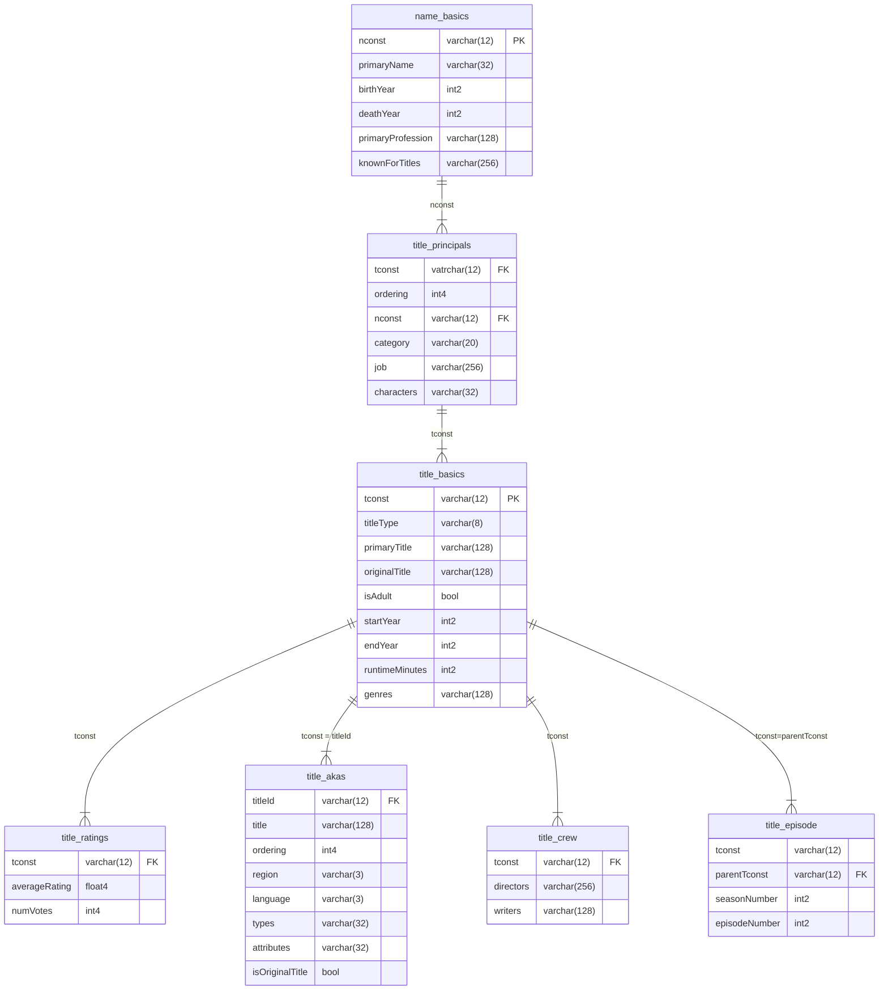

```mermaid
erDiagram
    title_akas {
        titleId varchar(12) "FK"
        title varchar(128) ""
        ordering int4 ""
        region varchar(3) ""
        language varchar(3) ""
        types varchar(32) ""
        attributes varchar(32) ""
        isOriginalTitle bool ""
    }
    
    title_basics{
        tconst varchar(12) "PK"
        titleType varchar(8) ""
        primaryTitle  varchar(128) ""
        originalTitle varchar(128) ""
        isAdult bool ""
        startYear int2 ""
        endYear int2 ""
        runtimeMinutes int2 ""
        genres varchar(128) ""
    }
    
    title_crew{
        tconst varchar(12) "FK"
        directors varchar(256) ""
        writers varchar(128) ""
    }
    title_episode{
        tconst varchar(12) ""
        parentTconst varchar(12) "FK"
        seasonNumber int2 "" 
        episodeNumber int2 ""
    }

    title_principals{
        tconst vatrchar(12) "FK"
        ordering int4 ""
        nconst varchar(12) "FK"
        category varchar(20) ""
        job varchar(256) ""
        characters varchar(32) ""
    }
    title_ratings{
        tconst varchar(12) "FK"
        averageRating float4 ""
        numVotes int4 ""
    }
    name_basics{
        nconst varchar(12) "PK"
        primaryName varchar(32)
        birthYear int2 ""
        deathYear int2 ""
        primaryProfession varchar(128) ""
        knownForTitles varchar(256) ""
    }
    name_basics ||--|{ title_principals : nconst
    title_principals ||--|{ title_basics : tconst
    title_basics ||--|{ title_ratings  : tconst
    title_basics ||--|{ title_akas : "tconst = titleId"
    title_basics ||--|{ title_crew : tconst
    title_basics ||--|{ title_episode : "tconst=parentTconst"
```