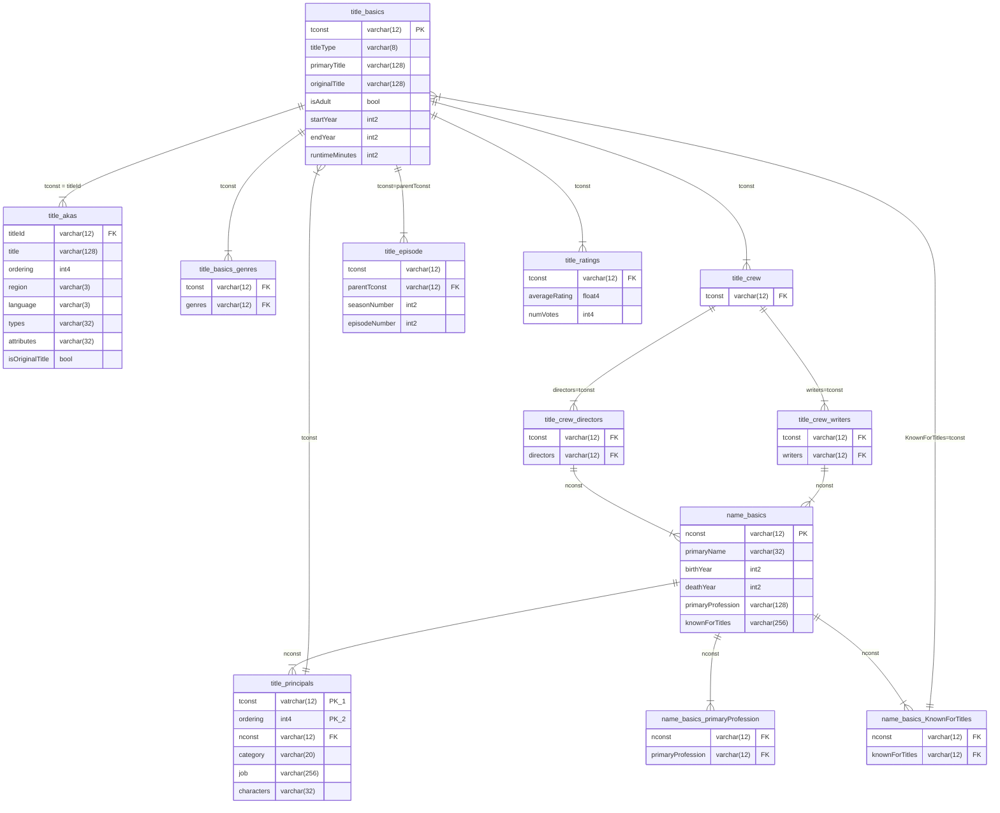

```mermaid
erDiagram
	title_akas {
        titleId varchar(12) "FK"
        title varchar(128) ""
        ordering int4 ""
        region varchar(3) ""
        language varchar(3) ""
        types varchar(32) ""
        attributes varchar(32) ""
        isOriginalTitle bool ""
	}
	
	title_basics{
		tconst varchar(12) "PK"
		titleType varchar(8) ""
		primaryTitle  varchar(128) ""
		originalTitle varchar(128) ""
		isAdult bool ""
		startYear int2 ""
		endYear int2 ""
		runtimeMinutes int2 ""
	}

    title_basics_genres{
		tconst varchar(12) "FK"
		genres varchar(12) "FK"
	}
	
	title_crew{
		tconst varchar(12) "FK"
	}
    title_crew_directors{
        tconst varchar(12) "FK"
        directors varchar(12) "FK"
    }
    title_crew_writers{
        tconst varchar(12) "FK"
        writers varchar(12) "FK"
    }
	title_episode{
		tconst varchar(12) ""
		parentTconst varchar(12) "FK"
		seasonNumber int2 "" 
		episodeNumber int2 ""
	}

    title_principals{
        tconst vatrchar(12) "PK_1"
        ordering int4 "PK_2"
        nconst varchar(12) "FK"
        category varchar(20) ""
        job varchar(256) ""
        characters varchar(32) ""
    }
    title_ratings{
        tconst varchar(12) "FK"
        averageRating float4 ""
        numVotes int4 ""
    }
    name_basics{
        nconst varchar(12) "PK"
        primaryName varchar(32)
        birthYear int2 ""
        deathYear int2 ""
        primaryProfession varchar(128) ""
        knownForTitles varchar(256) ""
    }
    name_basics_primaryProfession{
        nconst varchar(12) "FK"
        primaryProfession varchar(12) "FK"
    }
    name_basics_KnownForTitles{
        nconst varchar(12) "FK"
        knownForTitles varchar(12) "FK"
    }
    name_basics ||--|{ title_principals : nconst
    title_principals ||--|{ title_basics : tconst
    title_basics ||--|{ title_ratings  : tconst
    title_basics ||--|{ title_akas : "tconst = titleId"
    title_basics ||--|{ title_crew : tconst
    title_basics ||--|{ title_episode : "tconst=parentTconst"
    title_crew ||--|{ title_crew_directors : "directors=tconst"
    title_crew ||--|{ title_crew_writers : "writers=tconst"
    title_crew_directors ||--|{ name_basics : nconst
    title_crew_writers ||--|{ name_basics : nconst 
    title_basics ||--|{ title_basics_genres : tconst
    name_basics ||--|{ name_basics_primaryProfession : nconst
    name_basics ||--|{ name_basics_KnownForTitles : nconst
    name_basics_KnownForTitles ||--|{ title_basics : "KnownForTitles=tconst"
``` 